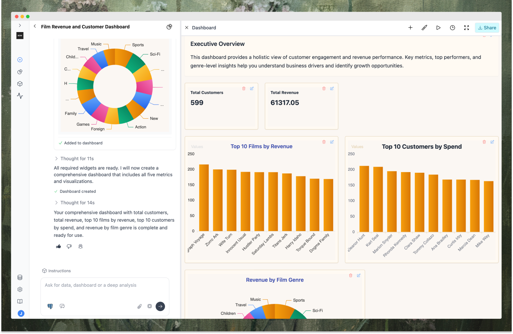
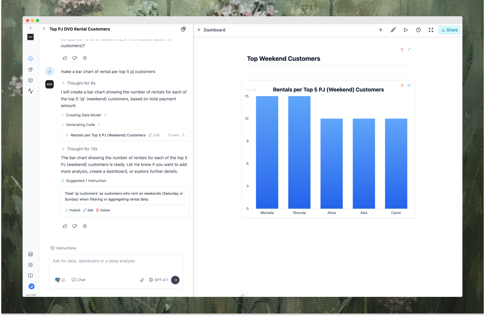
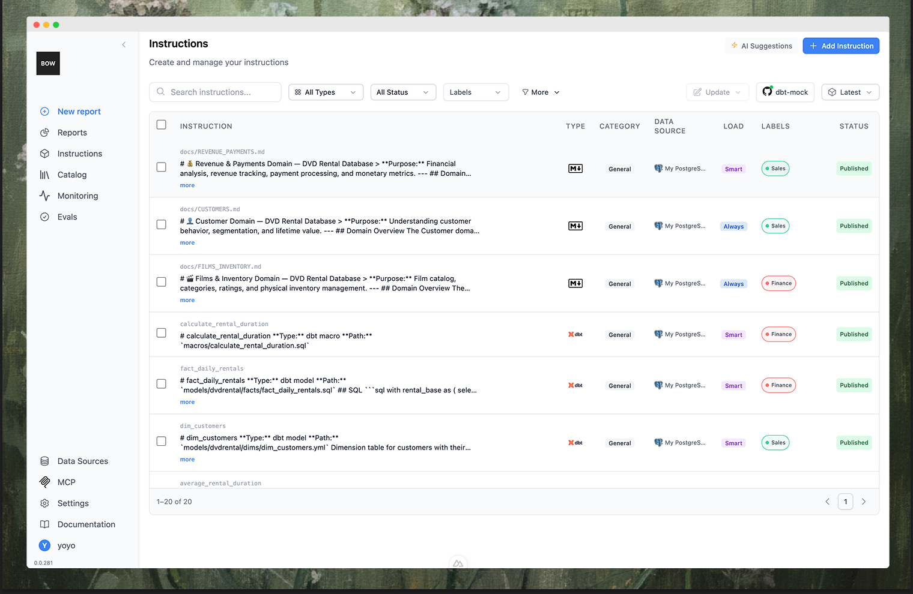
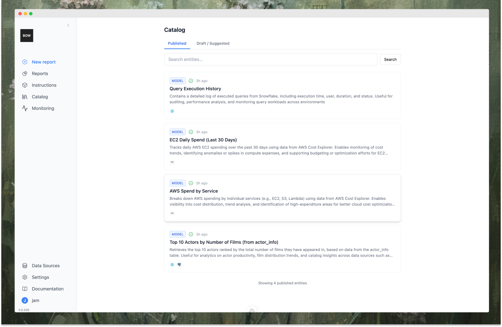
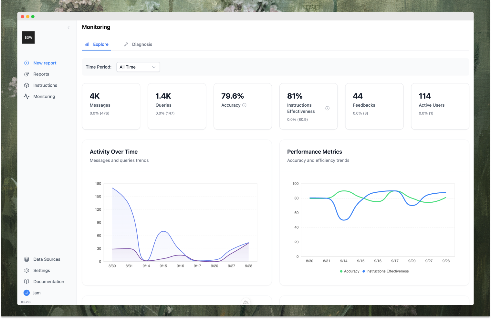

# Open-Source AI Analyst/MCP for your data, deploy in minutes

Connect any LLM to any data source through a unified context layer (instructions, docs, dbt, code) with full observability.

Built for reliable quick answers and deeper investigations like root-cause analysis.

**Features:**

- **Agentic loop** - chat with data, ask complex questions, run multi-step analysis with tools, reasoning, and reflection  
- **Any LLM ↔ Any warehouse** - OpenAI, Anthropic, Gemini, Ollama ↔ Snowflake, BigQuery, Postgres, Redshift  
- **Instructions Registry** - definitions, rules, and context with versioning and approval workflows; git sync with auto-indexing of dbt, markdown, code, and more 
- **Self-learning** - learns from usage and surfaces instruction and semantic-layer updates, review-gated  
- **Reliability** - full observability: agent traces, plans, guardrails, LLM judges, evals  
- **Auth & deploy** - run via Docker/Compose/k8s with SSO, RBAC, warehouse inherited permissions, and audit trail  
- **The Data MCP** - use MCP to interact with your data from Cursor, Claude Desktop, and other AI clients while reliably tracking your requests and data operations

---

## Overview

### Chat with any data
Create reports, deep analysis or quick visuals with an AI interface powered by an agentic-loop with tools, reasoning and reflection built in. 

    
    <i></i>

### Instructions Registry
Manage AI rules and instructions with review process, full versioning and tracking. Sync with git to auto-index dbt, Tableau, AGENTS.md and more.

    
    <i></i>

### Save data and queries to the Catalog
Leverage the catalog to store, share, and explore reusable queries and datasets. This feature also improves discoverability and searchability for AI, contributing to smarter AI decisions.

    

### Monitor AI and data operations
Full observability into queries, feedback, and context — powering self-learning and high quality AI results

    

## Integrations

### Supported LLM Integrations

You can bring your own API key for any of the following:

| Provider         | Supported Models / APIs         | Notes                                                                 |
|------------------|---------------------------------|-----------------------------------------------------------------------|
| **OpenAI**       | GPT models, o-models, etc.    | Any OpenAI-compatible endpoint (including self-hosted, vLLM, etc.)    |
| **Azure OpenAI** | GPT models, o-models, etc.            | Azure resource/endpoint support, including model deployment names      |
| **Google Gemini**| Gemini, Flash versions, etc.    | Requires Google Cloud API key                                         |
| **Anthropic**    | Claude, Sonnet, Haiku    | Just provide the API key          |
| **Any OpenAI-compatible** | vLLM, LM Studio, Ollama, etc. | Just provide the base URL and API key                                 |

> **Tip:** You can configure multiple providers and models, set defaults, and more.

### Data Sources

#### Supported Data Sources

Below is a list of all data sources supported, as defined in the data source registry. Each entry is marked as either a **Database/Warehouse** or a **Service**.

| Title                    | Kind                |
|--------------------------|---------------------|
| PostgreSQL               | Database/Warehouse  |
| Snowflake                | Database/Warehouse  |
| Google BigQuery          | Database/Warehouse  |
| NetSuite                 | Service             |
| MySQL                    | Database/Warehouse  |
| AWS Athena               | Database/Warehouse  |
| MariaDB                  | Database/Warehouse  |
| DuckDB                   | Database/Warehouse  |
| Salesforce               | Service             |
| Microsoft SQL Server     | Database/Warehouse  |
| ClickHouse               | Database/Warehouse  |
| Azure Data Explorer      | Database/Warehouse  |
| AWS Cost Explorer        | Service             |
| Vertica                  | Database/Warehouse  |
| AWS Redshift             | Database/Warehouse  |
| Tableau                  | Service             |
| Presto                   | Database/Warehouse  |
| Apache Pinot             | Database/Warehouse  |
| Oracle DB                | Database/Warehouse  |
| MongoDB                  | Database/Warehouse  |

> **Note:** Some data sources (like NetSuite) may be marked as inactive or beta in the registry. "Service" refers to APIs or SaaS platforms, while "Database/Warehouse" refers to systems that store and query structured data.

