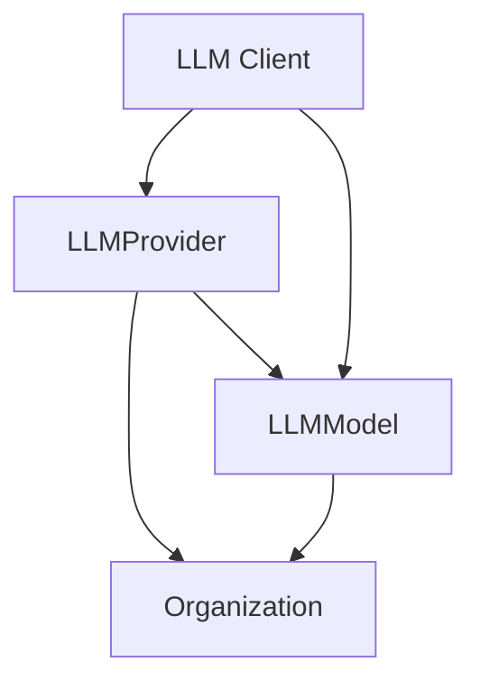

# Language Models

Bag of words allows users to integrate to a variety of language models. 

## Overview

A user can create a new LLM provider (that holds the credentials to the LLM provider) and an LLM model (that holds the model name and other configurations). 

The supported LLM providers are:
- OpenAI
- Anthropic
- Google
- Azure OpenAI

The supported LLM models are:
- OpenAI: GPT-5, GPT-4.1, GPT-4.1 Mini
- Anthropic: Claude 4.5 Sonnet, Claude 4 Sonnet, Claude 4 Opus
- Google: Gemini 2.5 Pro, Gemini 2.5 Flash

**Add LLM Provider:** To add an LLM provider, you need to add the provider type to the `LLM_PROVIDER_DETAILS` list in the `llm_provider.py` file.

**Add LLM Model:** To add an LLM model, you need to add the model type to the `LLM_MODEL_DETAILS` list in the `llm_model.py` file.

## Features
- Secure credential management
- Provider-specific configuration
- Model preset management 
- Organization-level customization
- Streaming and non-streaming inference

## Language Model Architecture

### Core Components

#### LLM Provider (`llm_provider.py`)
- Base database model for LLM service providers (OpenAI, Anthropic, Google, BOW)
- Handles encrypted credentials and provider-specific configs
- Links to organization and models

#### LLM Model (`llm_model.py`) 
- Database model for specific language models
- Predefined models per provider:
  - OpenAI: GPT-5, GPT-4.1, GPT-4.1 Mini
  - Anthropic: Claude 4.5 Sonnet, Claude 4 Sonnet, Claude 4 Opus
  - Google: Gemini 2.5 Pro, Gemini 2.5 Flash
  - BOW: BOW Small
- Links to provider and organization

#### LLM Schemas (`llm_schema.py`)
- Pydantic models for validation and serialization
- Provider schemas with credentials and configs
- Model schemas for CRUD operations

#### LLM Client (`llm.py`)
- Main interface for LLM interactions
- Dynamic provider client selection
- Supports sync/async inference

### Relationships

